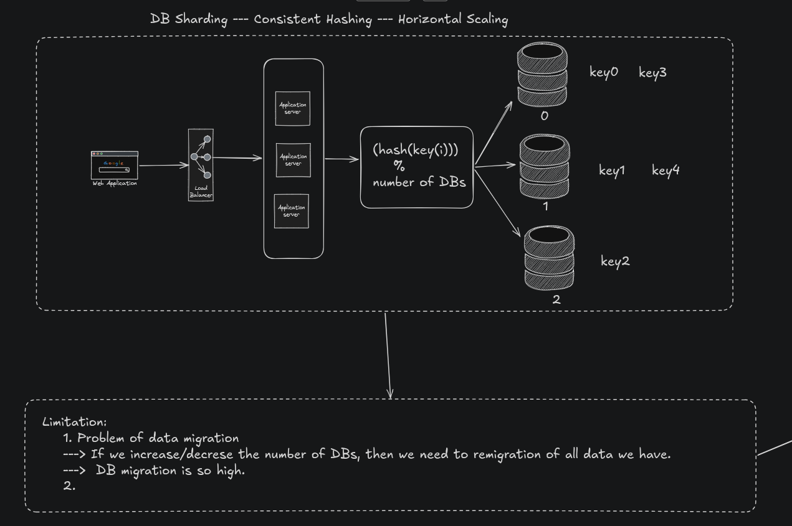
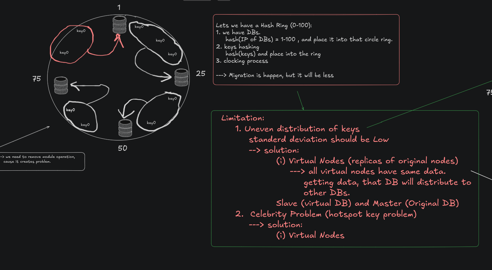
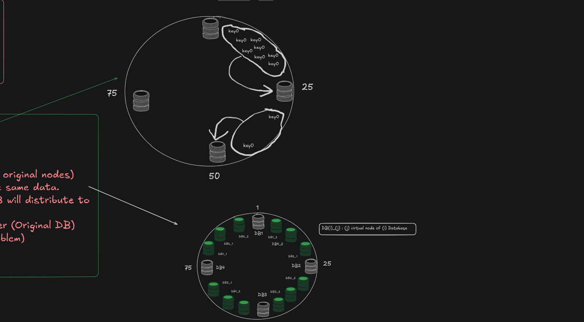

### DB Sharding:
Database sharding is a technique for horizontal scaling of databases, where the data is split across multiple database instances, or shards, to improve performance and reduce the impact of large amounts of data on a single database.
	It is basically a database architecture pattern in which we split a large dataset into smaller chunks (logical shards) and we store/distribute these chunks in different machines/database nodes (physical shards).
	- Each chunk/partition is known as a "shard" and each shard has the same database schema as the original database.
	- It's a good mechanism to improve the scalability of an application.

### DATA format: (Key) ----> (Value)
### Normal Method:
Use modulo oparetor. To get in which DB, we will store that Data.
#### Limitation: 
1. Problem of data migration
		- If we increase or decrease the number of DBs, then we need to remigration of all data we have.
		- DB migration is so high.

### Consistent Hashing;
Consistent hashing is a technique used in distributed systems and load balancing to distribute data or requests across multiple servers efficiently. It reduces the amount of re-mapping (rehashing) needed when servers are added or removed, improving scalability and stability.

- Both servers and requests are mapped onto a virtual hash ring using a hash function, which is treated as having an infinite number of points.
- Each request is assigned to the nearest server in the clockwise direction on the ring.
- When a server is added or removed, only a small portion of requests are redistributed, improving scalability and stability.

****Note:**** In consistent hashing, a request is mapped to the first server encountered in the clockwise direction on the hash ring after hashing the request key.

#### Limitation:
- Uneven Distribution of Data: Data is not evenly spread across servers, causing some servers to be overloaded while others remain underutilized.
- Celebrity Problem: Some DB might have 'hotspot keys', then that DB might face high load compare to other.
			imagine, that DB have Information about some Celebrity

Solution:
As a Solution, we can introduce *Virtual Node* concept.
